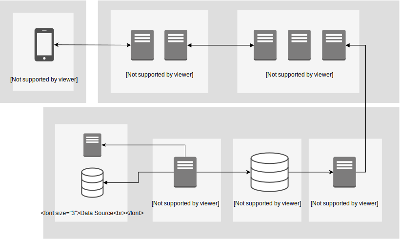

# 検索システム Elasticsearch編
基礎編では検索システムの基本的な考え方を説明しました。
今回は実際のプロダクションに検索システム、Elasticsearchを導入するにはどうするのかを解説します。

## OSSの全文検索エンジン
実用的な検索システムは、実装しなくてはならない機能がかなりたくさんあるため、
ふつうはOSSの検索エンジンを利用します。

サーバーとしての機能や、分散システムとしての機能をもつOSSの検索エンジンを利用することで
より検索以外の機能開発に注力することができるようになります。

有名な全文検索エンジンに、**Elasticsearch**や**Solr**などがあります。
ElasticsearchとSolrは、どちらも内部の検索ライブライのコアにApache Luceneを利用しています。
他の例としては、Yahoo inc製の[Vespa](https://vespa.ai)があり、大規模な検索システムで、かなり高速に動作するという特徴があります。

検索システムの実用編では、現在最も人気のあるElasticsearchを使いながら検索システムについて学びます。

## 検索システムの全体像
まず、検索システムの導入する際の全体像を見ていきます。
検索システムでは、システムの構成要素は、データの登録に関わるものと検索に関わるものに分類できます。

図中の上半分が、検索に関わるシステム、下半分が登録処理に関わるシステムです。



|システム名 | 役割 |
|:---|:---|
| クローラー (Crawler) | 検索エンジンに必要なデータを集めるシステム |
| インデクサー (Indexer) | 検索エンジンにデータを登録するシステム |
| 検索エンジン (Search Engine) | Elasticsearchなどの検索エンジン |
| 検索API (Search API) | 検索のビジネスロジック等を記載する |
| 検索フロント・アプリ (FE / APP) | 検索APIを利用して、検索機能をユーザーが使えるようにする |

### クローラー (Crawler)
サービスに検索機能を実装しようとした場合、サービスで利用している様々なデータを収集してくる必要があります。クローラーは定期的にデータを収集してくるプロセスです。

例えば、ショッピングサービスだった場合は、商品の情報や在庫の変動などを検索システムに反映する必要があります。
あるいは、WEB検索システムだった場合は、WEBサイトをスクレイピングしてデータの情報を収集する必要があります。

収集したデータはファイルでディスクに保存するのではなく、データベースやメッセージキューなどに保管すると、複数台のサーバーからデータにアクセスできるため扱いやすくなります。


### インデクサー (Indexer)
インデックスを利用した検索は事前にインデックスを作成しておく必要があります。
インデクサーは収集したデータを実際に検索エンジンに登録するプロセスです。
具体的には、データを整形し、検索エンジンへPOSTリクエストを送ります。
このプロセスを常時稼働させることで、リアルタイムに検索エンジンにデータ更新を行います。

### 検索エンジン (Search Engine)
ElasticsearchやSolrなどの検索エンジンです。
大規模な検索システムを作ろうとする場合、1台の構成ではデータが乗り切らない、十分なパフォーマンスが出せないため、ダウンすると検索機能が停止してしまうため、通常は複数台構成にします。

ElasticsearchやSolrを利用すると、分散検索、分散インデックス機能を利用することができるため、システムの可用性を高めることができます。

### 検索API (Search API)
検索システムを運用していくと、サービスに応じたビジネスロジックを記載したくなることがあります。
検索APIを提供することで、検索システムが扱いやすくなります。

## 検索エンジンの構成図
次に検索エンジン自体の構成を見ていきます。

検索エンジンと言っても、SolrやElasticsearchは様々な検索以外の機能を持っています。
基礎編で実装したような検索のコアアルゴリズムが実装されている、**Apache Lucene**です。


LuceneはJavaで記載されており、高速に全文検索を行うことができます。
Luceneを実際に利用するには、Javaでプログラムを記載し、Luceneのクラスを利用する形になります。

検索機能をREST APIで利用するには、ElasticsearchやSolrを用いる必要があります。
どちらもJavaで作られており、内部的にはLuceneの検索機能を利用しています。
単にサーバー化するだけではなく、実際のプロダクションで必要になるシャーディングやレプリケーションなどの機能も持っています。他にも現場で必要になるいろいろな機能が利用できます。

## Elasticsearchを使ってみる

### Elasticsearchの起動
Elasticsearchのインストール方法は、[環境構築](./00-環境構築.md)を参考にしてください。

まず、ローカル実行環境でElasticsearchを立ちあげます。

コンソールを新規起動し、以下のコマンドを実行します。
```
$ docker run -p 9200:9200 -p 9300:9300 -e "discovery.type=single-node" docker.elastic.co/elasticsearch/elasticsearch:7.3.2
```

プロセスを起動したまま、別のコンソールを立ち上げ、起動を確認します。
以下のような結果が返ってくれば問題ないです。
```
$ curl -XGET http://localhost:9200/
{
  "name" : "7ad4da73795c",
  "cluster_name" : "docker-cluster",
  "cluster_uuid" : "bpA1hj2iS_-Bh0UHjKr2xw",
  "version" : {
    "number" : "7.3.2",
    "build_flavor" : "default",
    "build_type" : "docker",
    "build_hash" : "1c1faf1",
    "build_date" : "2019-09-06T14:40:30.409026Z",
    "build_snapshot" : false,
    "lucene_version" : "8.1.0",
    "minimum_wire_compatibility_version" : "6.8.0",
    "minimum_index_compatibility_version" : "6.0.0-beta1"
  },
  "tagline" : "You Know, for Search"
}
```

## Elasticsearchの用語
Elasticsearchの利用を始める前に、用語を整理します。

### ドキュメント
ドキュメントはElasticsearchに格納されるデータの単位です。RDBでのレコードに対応します。
ドキュメントはJSON形式のオブジェクトで表されます。
内部的にIDによって管理されており、ドキュメントを登録する際は、IDを明示的に与えるか、与えなかった場合は自動でIDが割り振られます。

### フィールド
JSON形式のキー、バリューの組をフィールドといいます。
データ型として、文字列、数値、日付などが格納可能です。

例えば、以下のようなJSONがあったとします。
ここでの"key1": "value1"がフィールドです。
```
{
    "key1": "value1",
    "key2": "value2"
}
```

転置インデックスはフィールドごとに作成されます。

### 利用可能なデータ型
#### text型
文字列の型。アナライザによる形態素解析で、
文章が単語に分割され、その単語ごとに転置インデックスが構築されます。

#### keyword型
text型と同様に文字列ですが、アナライザによる**形態素解析が行われません**。
分割せずにインデックスを作りたい場合は、keywordを利用します。

#### 数値型
long, short, integer, floatなどが利用可能です。
数値の大小比較で検索を行うことができます。

#### 日付型
日付による検索が行えます。

#### 真偽型 (boolean)
true, falseの指定ができます。

#### オブジェクト型
JSONオブジェクト自体をデータ型として扱うことができます。

#### 配列型
各要素が同じ型をもつ、配列型を定義することができます。

### インデックスについて
ドキュメントは**インデックス**に保存されます。
通常、Elasticsearchは、複数のサーバー(ノード)で起動し、それぞれのノードは
分割されたインデックスを持ちます。
このとき分割される単位を**シャード**(**shard**)と呼びます。

ドキュメントがどのような構成になっているか表す構造をドキュメントタイプと呼びます。
例えば、ショッピングサービスの検索システムを考えてみると、商品名、商品説明、商品価格、在庫の有無などがドキュメントのデータ構造となり、ドキュメントタイプとなります。

ドキュメントタイプを実際に記述したものは**マッピング**(**mapping**)と呼ばれます。
Elasticsearchではドキュメントタイプを明示的に記載しなくても、型を自動的に推測してドキュメントを格納します。text型とkeyword型のように区別がつかない場合は明示的に指定する必要があります。

### クラスタについて
Elasticsearchは複数の**ノード**で起動します。1つのJVMにつき1つElasticsearchが立ち上がり、これが1ノードとなります。複数のノードで起動した場合、それぞれのノードが協調して動作します。このノードのグループの単位を**クラスタ**と呼びます。

Elasticsearchは簡単な設定を行うだけで、複数ノードで構成することができます。
クラスタ構成にすることで、検索のドキュメント数の増大や、負荷の対策を行うことができます。
また、**レプリケーション**を行うことで、シャードが複製して配置されるようになります。


