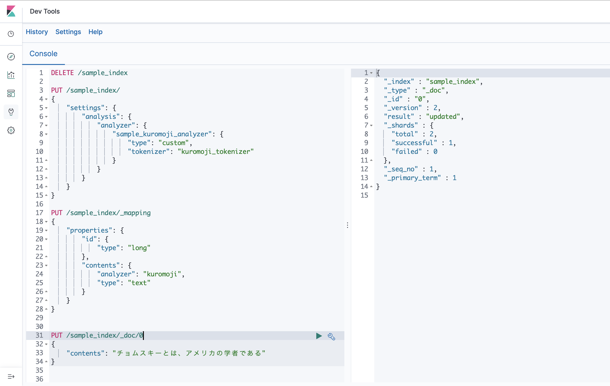

## 検索システム Elasticsearch編

## REST APIによるドキュメントの操作
Elasticsearchでは、REST-APIを提供しています。
また、Java, JavaScript, Ruby, Go, PHP, Perl, Pythonなどの言語でクライアントが提供されています。
クライアントを利用することで、より簡単にElasticsearchを操作APIできますが、今回はREST APIを利用します。

Elasticsearchの環境構築は[環境構築](00-環境構築.md)を参照してください。

## ElasticsearchのAnalyzer
[検索システム基礎編](01-検索システム基礎編.md)で見たように、全文検索では文章を単語に分割し、単語ごとに転置インデックスを作成します。
これを実現するために、Elasticsearchでは`Analyzer`が利用されます。
Elasticsearchの標準機能では、日本語の形態素解析が行えないため、追加のプラグインをインストールします。
**kuromoji Analysis Plugin**が利用されます。

## Kibanaを利用する
[環境構築](00-環境構築.md)では、Kibanaと言うアプリケーションを同時にインストールして、立ち上げています。
インストールに成功していた場合は、以下のURLでkibanaが立ち上がっています。

http://localhost:5601

今回作成したインデックス`sample_index`を登録してみます。
以下のURLを開き、`Create index pattern`からインデックスを登録します。
 
http://localhost:5601/app/kibana#/management/kibana/index_patterns

以下の説明では、GET, PUT, POSTリクエストなどを用いて、インデックスの作成、データの登録などを行っていますが、
kibanaのUIを利用して、簡単にリクエストを作成、送信などを行うことができます。

画面左のDev toolsからコンソール画面を開き、リクエストの作成などを行うことができます。


以下で各種操作のリクエストを記載していますが、[こちらの一覧](elasticsearch-devtool.txt)をそのままコンソールに貼り付けることで、
簡単にElasticsearchを操作できます。

### インデックスを作成
PUTリクエストでインデックスを作成します。この時、日本語の形態素解析のためにkuromojiを利用する設定の記載をしておきます。

```
PUT /sample_index/
{
    "settings": {
        "analysis": {
            "analyzer": {
                "sample_kuromoji_analyzer": {
                    "type": "custom",
                    "tokenizer": "kuromoji_tokenizer"
                }
            }
        }
    }
}
```

### インデックスの削除
DELETEメソッドでインデックスを削除します。

```
DELETE /sample_index
```

### マッピングの生成
ドキュメントのフィールドのデータ構造を明示的に記載したものをマッピングと呼びます。
`{インデックス名}/_mapping`でマッピングに関する操作を行うことができます。

```
PUT /sample_index/_mapping
{
    "properties": {
        "id": {
          "type": "long"
        },
        "bookTitle": {
          "analyzer": "kuromoji",
          "type": "text"
        },
        "price": {
          "type": "integer"
        },
        "contents": {
            "analyzer": "kuromoji",
            "type": "text"
        }
    }
}
```

### マッピングの確認
生成されたマッピングは以下で確認できます。
```
GET /sample_index/_mapping
```

### ドキュメントの登録
ElasticsearchのドキュメントはJSON形式で表されます。
ドキュメントを登録するためには、PUTメソッド、POSTメソッドを利用します。

PUTメソッド利用してIDを指定したドキュメントの登録ができます。

```
/{インデックス名}/_doc/{ID}/
```

prettyをつけることで整形された出力結果が返ってきます。

```
PUT /sample_index/_doc/0
{
  "id": 100,
  "bookTitle": "チョムスキーについて",
  "price": 1000,
  "contents": "チョムスキーとは、アメリカの学者である"
}
```

成功すると以下のようなレスポンスが返却されます。
```
{
  "_index" : "sample_index",
  "_type" : "_doc",
  "_id" : "0",
  "_version" : 1,
  "result" : "created",
  "_shards" : {
    "total" : 2,
    "successful" : 1,
    "failed" : 0
  },
  "_seq_no" : 0,
  "_primary_term" : 1
}
```

POSTメソッドの場合は、IDが自動的に生成されます。IDを指定する必要がありません。
```
/{インデックス名}/_doc/
```

```bash
POST /sample_index/_doc
{
  "id": 200,
  "bookTitle": "アインシュタインについて",
  "price": 2000,
  "contents": "アインシュタインとは、ドイツの学者である"
}
```

成功すると以下のようなレスポンスが返却されます。
```
{
  "_index" : "sample_index",
  "_type" : "_doc",
  "_id" : "H9a13W8B_axkRGOMPle7",
  "_version" : 1,
  "result" : "created",
  "_shards" : {
    "total" : 2,
    "successful" : 1,
    "failed" : 0
  },
  "_seq_no" : 1,
  "_primary_term" : 1
}

```

さらに追加します。
```
POST /sample_index/_doc
{
  "id": 300, 
  "bookTitle": "ベルについて",
  "price": 2000,
  "contents": "ベルとは、スコットランドの発明家である"
}
```

形態素解析の結果を確認するには`_analyze`をGETリクエストします。
```
GET /sample_index/_analyze
{
  "analyzer": "kuromoji",
  "text": "チョムスキーとは、アメリカの学者である"
}
```
以下のような結果になりました。
```
{
  "tokens" : [
    {
      "token" : "チョムスキ",
      "start_offset" : 0,
      "end_offset" : 6,
      "type" : "word",
      "position" : 0
    },
    {
      "token" : "アメリカ",
      "start_offset" : 9,
      "end_offset" : 13,
      "type" : "word",
      "position" : 3
    },
    {
      "token" : "学者",
      "start_offset" : 14,
      "end_offset" : 16,
      "type" : "word",
      "position" : 5
    }
  ]
}
```

### ドキュメントの取得
ドキュメントを単に取得する（検索ではなく直接取得）には、GETポイントにドキュメントのIDを指定します。
POSTリクエストで登録した場合、curlのレスポンス結果のIDを利用してください。

```
GET /sample_index/_doc/0
```

### ドキュメントの検索
ドキュメントを検索するには、エンドポイントの最後に **_search** を付けます。

```
GET /sample_index/_search
{
  "query": {
    "match": {
      "contents": "学者"
    }
  }
}
```

学者が含まれるドキュメントだけが出力されたことがわかります。
```
{
  "took" : 1,
  "timed_out" : false,
  "_shards" : {
    "total" : 1,
    "successful" : 1,
    "skipped" : 0,
    "failed" : 0
  },
  "hits" : {
    "total" : {
      "value" : 2,
      "relation" : "eq"
    },
    "max_score" : 0.49005118,
    "hits" : [
      {
        "_index" : "sample_index",
        "_type" : "_doc",
        "_id" : "0",
        "_score" : 0.49005118,
        "_source" : {
          "id" : 100,
          "bookTitle" : "チョムスキーについて",
          "price" : 1000,
          "contents" : "チョムスキーとは、アメリカの学者である"
        }
      },
      {
        "_index" : "sample_index",
        "_type" : "_doc",
        "_id" : "LkpY3m8BwV0jPXdLNVKZ",
        "_score" : 0.49005118,
        "_source" : {
          "id" : 200,
          "bookTitle" : "アインシュタインについて",
          "price" : 2000,
          "contents" : "アインシュタインとは、ドイツの学者である"
        }
      }
    ]
  }
}
```

## 集約 Aggregation
Elasticsearchでは検索結果に対して、集計処理や統計量の計算などを行うことができます。
例えば、Eコマースのようなサービスで、商品情報をインデックスしていたとき、
あるワードにヒットするドキュメントの合計金額や、ジャンル別の件数を求めることができます。

例えば、検索にヒットしたドキュメントの統計量を出力したい時以下のように指定します。
```
GET /sample_index/_search
{
  "query": {
    "match": {
      "contents": "学者"
    }
  },
  "aggs": {
    "doc_stats": {
      "stats": {
        "field": "price"
      }
    }
  }
}
```

レスポンスにaggregationsが追加されており、2件ヒットして、最大値2000、最初うち1000、平均1500、総和3000であることが分かります。
```
"aggregations" : {
  "doc_stats" : {
    "count" : 2,
    "min" : 1000.0,
    "max" : 2000.0,
    "avg" : 1500.0,
    "sum" : 3000.0
  }
}
```

値の範囲で集約をかけることができます。以下のリクエストを送ると、価格を次の範囲でそれぞれ集約した結果を計算します。

1. `0 <= price < 1000`
2. `1000 <= price < 2000`
3. `2000 <= price < 3000`

```
GET /sample_index/_search
{
  "query": {
    "match_all": {}
  },
  "aggs": {
    "doc_metrics": {
      "range": {
        "field": "price",
        "ranges": [
          {
            "from": 0,
            "to": 1000
          },
          {
            "from": 1000,
            "to": 2000
          },
          {
            "from": 2000,
            "to": 3000
          }
        ]
      }
    }
  }
}
```

以下のレスポンスが含まれます。
```
"aggregations" : {
  "doc_metrics" : {
    "buckets" : [
      {
        "key" : "0.0-1000.0",
        "from" : 0.0,
        "to" : 1000.0,
        "doc_count" : 0
      },
      {
        "key" : "1000.0-2000.0",
        "from" : 1000.0,
        "to" : 2000.0,
        "doc_count" : 1
      },
      {
        "key" : "2000.0-3000.0",
        "from" : 2000.0,
        "to" : 3000.0,
        "doc_count" : 2
      }
    ]
  }
}
```

## まとめ
今回はREST APIを利用した、Elasticsearchの基本的な使い方を見ていきました。
次回は、実際の運用や機械学習の適用方法など、より実践的な内容を説明します。
